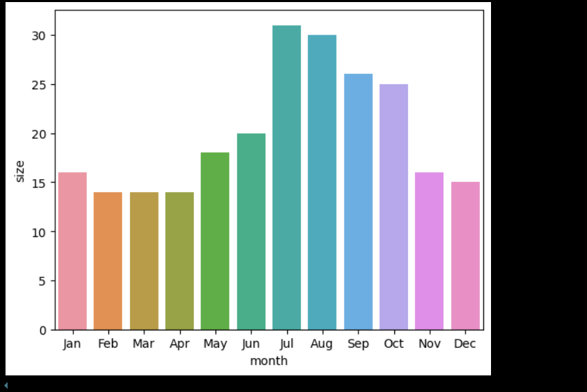

# YouTube Analysis

This repository contains a Jupyter Notebook dedicated to analyzing YouTube channel data. The analysis focuses on extracting and visualizing statistics from a specific YouTube channel using the YouTube Data API.

## Contents

- **youtube_analysis.ipynb**: The Jupyter Notebook containing the code for data extraction and analysis.
- **beluga.json**: A JSON file storing the YouTube channel statistics.
- **beluga.csv**: A CSV file containing the channel statistics for further analysis.

## Screenshots

### Analysis Results and Visualizations


*Top 10 videos based on viewcounts*


*Number of videos per month*


*Channel performance metrics and trends*


## Prerequisites

To run the notebook smoothly, ensure you have the following Python packages installed:

- json
- requests
- jdc
- tqdm
- pandas
- seaborn
- matplotlib

You can install these packages using pip:

```bash
pip install requests jdc tqdm pandas seaborn matplotlib
```

## Credentials

To access the YouTube Data API, the following credentials are used:

- **API Key**: "Enter your API ID"
- **Channel ID**: "Enter the channel ID"

**Note**: Ensure that the API key has the necessary permissions and is active for successful data retrieval.

## Usage

1. Clone the repository:
   ```bash
   git clone https://github.com/maddy333/YoutubeAnalysis.git
   cd YoutubeAnalysis
   ```

2. Install the required packages (if not already installed):
   ```bash
   pip install requests jdc tqdm pandas seaborn matplotlib
   ```

3. Open the Jupyter Notebook:
   ```bash
   jupyter notebook youtube_analysis.ipynb
   ```

4. Run the notebook cells to perform data extraction and analysis.

## Analysis Overview

The notebook performs the following tasks:

- **Data Extraction**: Retrieves channel statistics and video details using the YouTube Data API.
- **Data Storage**: Saves the extracted data into JSON and CSV formats for record-keeping and further analysis.
- **Data Visualization**: Utilizes seaborn and matplotlib to create visual representations of the data, aiding in understanding trends and patterns.

## Notes

- Ensure that your environment has internet access to connect to the YouTube Data API.
- Handle the API key securely and avoid exposing it in public platforms.
- The provided API key and channel ID are specific to this analysis; for analyzing other channels, replace the `channel_id` variable in the notebook with the desired channel's ID.